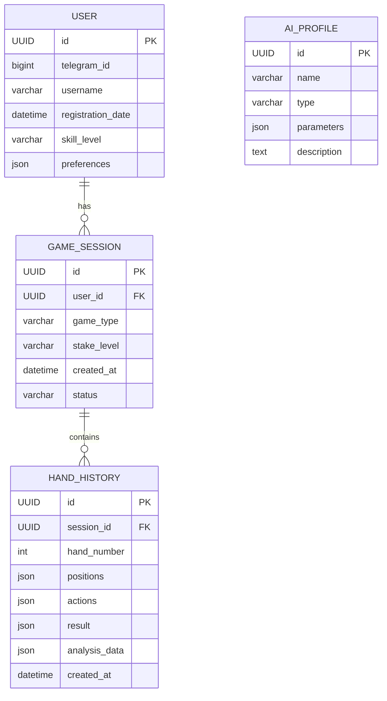

# ДОКУМЕНТАЦИЯ ПРОЕКТА

## Telegram-бот "Poker Mentor"

| | |
|---|---|
| **Название проекта:** | Poker Mentor |
| **Тип проекта:** | Образовательная платформа, Telegram-бот |
| **Версия документа:** | 1.0 |
| **Дата создания:** | 7 октября 2025 г. |
| **Автор документации:** | Manus AI |
| **Заказчик:** | [Имя заказчика или название компании] |


**Краткое описание:**

Настоящий документ представляет собой полную техническую и проектную документацию для Telegram-бота "Poker Mentor". Бот разработан как интеллектуальный помощник для обучения игре в покер, использующий модели искусственного интеллекта для симуляции игровых ситуаций, анализа действий пользователя и предоставления персонализированных рекомендаций. Документация охватывает все аспекты проекта: от первоначальных бизнес-требований и системного анализа до детального технического задания, плана тестирования и критериев приемки.

Этот документ предназначен для разработчиков, менеджеров проекта, тестировщиков и других заинтересованных сторон, участвующих в жизненном цикле проекта.


--- 
*Конфиденциально. Все права защищены.*


---

# 2. Метрика содержания

В данном разделе представлена метрика, отражающая структуру, объем и назначение каждого раздела настоящей документации. Это позволяет быстро оценить состав документа и значимость его отдельных частей. Каждый раздел был разработан с целью предоставления исчерпывающей информации для соответствующего этапа жизненного цикла проекта и рассчитан на объем не менее одной условной страницы.

| № | Раздел документации | Приблизительный объем (стр.) | Ключевое содержание |
|---|---|---|---|
| 1 | Титульный лист | 1 | Общая информация о проекте, названии, версии документа и его назначении. |
| 2 | Метрика содержания | 1 | Настоящий раздел. Структурный обзор документации с оценкой объема. |
| 3 | Перечень содержания | 1 | Детальное иерархическое оглавление для навигации по документу. |
| 4.1 | Бизнес-требования | 2-3 | Описание проблемы, бизнес-целей, целевой аудитории, ценностного предложения и KPI проекта. |
| 4.2 | Системный анализ | 3-4 | Детальный анализ компонентов системы, потоков данных, требований к производительности и безопасности. |
| 4.3 | План архитектуры | 2-3 | Визуальная и описательная схема архитектуры, технологический стек, модели данных и API. |
| 4.4 | Техническое задание | 3-4 | Конкретные задачи разработки, поэтапный план, оценка трудозатрат и ресурсов, критерии приемки. |
| 4.5 | План тестирования | 2-3 | Стратегия и виды тестирования, тестовые сценарии, критерии успешности тестов и необходимые ресурсы. |
| 4.6 | Отчет о приемке проекта | 1-2 | Заключительный документ для формальной сдачи-приемки проекта, включая чек-лист соответствия требованиям. |
| | **Итого** | **~15-20** | **Полная проектная и техническая документация** |

Эта метрика служит дорожной картой по документу, обеспечивая понимание его полноты и глубины проработки каждого аспекта проекта "Poker Mentor".


---

# 3. Перечень содержания

* 1. Титульный лист проекта
* 2. Метрика содержания
* 3. Перечень содержания
* 4. Содержание
    * 4.1. Бизнес-требования
        * 4.1.1. Введение
        * 4.1.2. Описание проблемы
        * 4.1.3. Бизнес-цели
        * 4.1.4. Целевая аудитория
        * 4.1.5. Ключевые преимущества и ценность
        * 4.1.6. Критерии успеха (KPI)
        * 4.1.7. Ограничения и риски
    * 4.2. Системный анализ
        * 4.2.1. Пользовательские истории и сценарии
        * 4.2.2. Функциональные требования
        * 4.2.3. Нефункциональные требования
        * 4.2.4. Потоки данных
    * 4.3. План архитектуры
        * 4.3.1. Общая архитектурная схема
        * 4.3.2. Компоненты системы
        * 4.3.3. Технологический стек
        * 4.3.4. Модели данных
        * 4.3.5. API и интеграции
    * 4.4. Техническое задание
        * 4.4.1. Обзор и цели MVP
        * 4.4.2. Детальный план разработки
        * 4.4.3. Оценка по объему работ
        * 4.4.4. Сроки реализации
        * 4.4.5. Критерии приемки
    * 4.5. План тестирования
        * 4.5.1. Стратегия тестирования
        * 4.5.2. Виды тестирования
        * 4.5.3. Тестовые сценарии (Test Cases)
        * 4.5.4. Ресурсы для тестирования
        * 4.5.5. Критерии успешности тестирования
* 5. Отчет о приемке проекта
    * 5.1. Заключение
    * 5.2. Чек-лист приемки
    * 5.3. Подписи сторон


---

# 4. Содержание

## 4.1. Бизнес-требования

### 4.1.1. Введение

Данный раздел описывает высокоуровневые бизнес-цели, задачи и ценность проекта "Poker Mentor". Он предназначен для согласования видения между заинтересованными сторонами и служит основой для последующих этапов проектирования и разработки. Проект представляет собой инновационное решение на стыке образования и геймификации, призванное демократизировать обучение покеру и сделать его доступным для широкой аудитории через популярную платформу Telegram.

### 4.1.2. Описание проблемы

В настоящее время рынок обучения покеру сталкивается с рядом барьеров, которые проект "Poker Mentor" призван устранить:

*   **Для новичков:** Покер — это игра с высоким порогом входа. Начинающие игроки часто сталкиваются с потерей денежных средств на начальном этапе из-за отсутствия понимания фундаментальных стратегий, математических основ и психологических аспектов игры. Им не хватает безопасной, интерактивной среды для тренировок без финансовых рисков, где ошибки были бы частью учебного процесса, а не причиной убытков.

*   **Для опытных игроков:** Существующие профессиональные инструменты для анализа игры, такие как солверы (solvers), являются сложными в освоении и использовании, требуют значительных вычислительных ресурсов и не обладают интерактивностью. Опытным игрокам не хватает удобной возможности для отработки конкретных игровых ситуаций (спотов) против оппонентов с различными, четко выраженными стилями игры, что необходимо для оттачивания адаптивных навыков.

*   **Общая проблема:** На рынке отсутствует доступный, интегрированный в популярный мессенджер (Telegram) инструмент, который бы комплексно объединял в себе функцию обучения, глубокого анализа раздач и симуляции реальной игры. Это создает разрыв между теорией, получаемой из книг и видео, и практикой, которая зачастую оказывается слишком дорогой.

### 4.1.3. Бизнес-цели

Проект преследует несколько ключевых бизнес-целей, определяющих его стратегическое направление.

| Цель | Описание |
| :--- | :--- |
| **1. Создание образовательного продукта** | Разработать уникальный AI-помощник, который эффективно снижает порог входа в покер и предоставляет инструменты для систематического улучшения игровых навыков пользователей любого уровня. |
| **2. Формирование активного сообщества** | Привлечь и удержать целевую аудиторию энтузиастов покера внутри экосистемы Telegram, создав вокруг бота активное сообщество для обучения, обмена опытом и обсуждения стратегий. |
| **3. Создание основы для будущей монетизации** | Разработать продукт с четким и сильным ценностным предложением, который в будущем может быть успешно монетизирован через введение премиум-функций (например, расширенный анализ, доступ к более продвинутым AI-оппонентам, глубокая персонализация обучения). |
| **4. Реализация технологического потенциала** | Осуществить разработку и внедрение сложной AI-системы для игры в покер, что само по себе является нетривиальной и амбициозной задачей с точки зрения машинного обучения и разработки игрового искусственного интеллекта. |

### 4.1.4. Целевая аудитория

Продукт ориентирован на три основных сегмента пользователей:

*   **Новички:** Лица, которые только начинают свой путь в покере. Они ищут структурированную информацию, хотят изучить правила и базовые стратегии в безопасной среде, где нет риска потери реальных денег.

*   **Любители (Enthusiasts):** Игроки, уже обладающие определенным опытом, но стремящиеся к совершенствованию. Они хотят "наточить свои навыки", получить объективный анализ своих игровых сессий и попрактиковаться в применении новых, более сложных стратегий против различных типов оппонентов.

*   **Преподаватели и тренеры по покеру:** Профессионалы, которые могут использовать бота в качестве интерактивного инструмента для демонстрации различных стратегий и концепций своим ученикам, а также для анализа их игровых сессий.

### 4.1.5. Ключевые преимущества и ценность

"Poker Mentor" предлагает пользователям уникальное ценностное предложение, основанное на следующих преимуществах:

*   **Доступность:** Бот функционирует непосредственно в Telegram, одном из самых популярных мессенджеров в мире. Это избавляет пользователей от необходимости устанавливать отдельные приложения или использовать мощный компьютер.

*   **Безрисковая среда:** Пользователи получают возможность практиковаться, совершать ошибки и учиться на них, не рискуя реальными деньгами. Это снимает психологический барьер и делает процесс обучения более комфортным.

*   **Интерактивное обучение:** Проект предлагает переход от пассивного потребления контента (чтение статей, просмотр видео) к активной практике в режиме реального времени против адаптивного искусственного интеллекта.

*   **Глубокая аналитика:** Возможность получить моментальный и детальный разбор каждой сыгранной руки от AI, что значительно ускоряет и углубляет процесс обучения.

*   **Гибкость и адаптивность:** Пользователи могут настраивать игровые сессии, симулируя игру против различных типов оппонентов ("фиш", "нит", "агрессор" и т.д.), что позволяет целенаправленно отрабатывать адаптивные стратегии.

### 4.1.6. Критерии успеха (KPI)

Успешность проекта будет измеряться на основе следующих ключевых показателей эффективности (KPI), которые отражают как вовлеченность пользователей, так и качество самого продукта.

| Метрика | Целевое значение (для MVP) | Описание и значимость |
| :--- | :--- | :--- |
| **Количество активных пользователей (DAU/MAU)** | 500 DAU / 2,000 MAU | Показывает реальную вовлеченность и полезность продукта для аудитории на ежедневной и ежемесячной основе. |
| **Количество сыгранных раздач в день** | 5,000+ | Прямой индикатор использования основной функции бота и его "липкости" для пользователей. |
| **Удержание пользователей (Retention Rate)** | 30% на 7-й день | Один из важнейших показателей. Демонстрирует, возвращаются ли пользователи к боту после первого знакомства с ним. |
| **Уровень удовлетворенности (Positive Feedback)** | > 80% позитивных отзывов | Качественная оценка удовлетворенности пользователей, получаемая через опросы в боте или анализ сообщений в комьюнити. |
| **Глубина использования функций** | > 15% пользователей регулярно используют функцию анализа рук | Показывает, что пользователи не только играют, но и активно используют продвинутые обучающие функции, что подтверждает ценность продукта. |

### 4.1.7. Ограничения и риски

При планировании проекта были учтены следующие ограничения и потенциальные риски:

*   **Технические риски:** Основной риск связан со сложностью разработки стабильного и достаточно сильного покерного AI, способного демонстрировать различные стили игры. Для митигации этого риска решено начать с rule-based моделей и постепенно усложнять их, внедряя элементы машинного обучения.

*   **Рыночные риски:** Существует риск низкого принятия продукта целевой аудиторией из-за высокой конкуренции со стороны существующих онлайн-покер-румов и специализированного программного обеспечения. Стратегия митигации заключается в уникальном предложении (интеграция с Telegram, фокус на обучении) и активном формировании комьюнити.

*   **Юридические риски:** Необходимо тщательно отслеживать законодательство в области азартных игр и использования AI в разных юрисдикциях. Продукт должен четко позиционироваться как образовательный инструмент, а не платформа для азартных игр на деньги.

*   **Ограничение команды:** Команда, состоящая из двух человек, накладывает естественные ограничения на скорость разработки и объем реализуемой функциональности в рамках первого релиза (MVP). Это требует строгой приоритизации задач и фокусировки на ключевых функциях.


---

## 4.2. Системный анализ

Данный раздел посвящен детальному анализу системы "Poker Mentor". Он включает в себя описание функциональных и нефункциональных требований, которые были сформулированы на основе пользовательских историй и бизнес-целей проекта. Также здесь представлены диаграммы потоков данных, иллюстрирующие ключевые процессы взаимодействия пользователя с системой.

### 4.2.1. Пользовательские истории и сценарии (User Stories)

Пользовательские истории являются основой для определения функциональных требований. Они описывают потребности различных типов пользователей и сценарии их взаимодействия с ботом. Ниже приведены обобщенные группы пользовательских историй, которые легли в основу проектирования системы.

| Категория | Ключевые пользовательские истории (User Stories) |
| :--- | :--- |
| **1. Онбординг и регистрация** | - **US-001:** Как новый пользователь, я хочу легко начать использование бота, чтобы быстро приступить к обучению.<br>- **US-002:** Как пользователь, я хочу настроить свой профиль (уровень навыков, цели), чтобы получать персонализированные рекомендации. |
| **2. Обучение и практика** | - **US-003:** Как пользователь, я хочу быстро начать игровую сессию с параметрами по умолчанию.<br>- **US-004:** Как продвинутый пользователь, я хочу детально настроить параметры тренировки (тип игры, сложность AI, стиль оппонента).<br>- **US-005:** Как игрок, я хочу комфортно и интуитивно понятно играть в покер через интерфейс бота. |
| **3. Анализ и обучение** | - **US-006:** Как обучающийся игрок, я хочу получать детальный разбор сыгранной руки с EV-анализом и альтернативными линиями розыгрыша.<br>- **US-007:** Как пользователь, я хочу иметь возможность проанализировать руку из другой игры, введя ее данные вручную.<br>- **US-008:** Как пользователь, я хочу видеть историю своих игровых сессий и отслеживать свой прогресс. |
| **4. Работа с AI** | - **US-009:** Как пользователь, я хочу играть против разных типов AI (Fish, TAG, LAG, Nit), чтобы научиться адаптироваться к разным стилям.<br>- **US-010:** Как пользователь, я хочу иметь возможность менять тип оппонента между раздачами. |
| **5. Дополнительные функции** | - **US-011:** Я хочу получать ежедневные задания для поддержания регулярности тренировок.<br>- **US-012:** Я хочу видеть свою подробную статистику и дашборд прогресса.<br>- **US-013:** Я хочу получать персонализированные советы по улучшению игры на основе анализа моей статистики. |
| **6. Технические сценарии** | - **US-014:** Я хочу, чтобы прерванная игровая сессия сохранялась, и я мог продолжить ее позже.<br>- **US-015:** Как новичок, я хочу иметь доступ к справочному разделу с правилами и базовыми стратегиями. |

### 4.2.2. Функциональные требования

На основе пользовательских историй были сформулированы следующие ключевые функциональные требования к системе:

*   **FR-01: Управление пользователями:**
    *   Система должна обеспечивать регистрацию пользователей на основе их Telegram ID.
    *   Пользователи должны иметь возможность создавать и редактировать свой профиль, включая уровень навыков, предпочитаемый тип игры и цели обучения.

*   **FR-02: Игровое ядро:**
    *   Система должна реализовывать полную логику игры в Техасский Холдем (раздача карт, раунды торгов, определение победителя).
    *   Должна быть обеспечена возможность игры как в формате "Быстрая игра" (с настройками по умолчанию), так и в настраиваемой сессии.
    *   Система должна поддерживать игру против AI-оппонентов.

*   **FR-03: Модуль AI:**
    *   Должно быть реализовано как минимум четыре различных профиля AI-оппонентов: Fish (слабый, пассивный), Nit (сверхаккуратный), TAG (тайтово-агрессивный), LAG (лузово-агрессивный).
    *   AI должен принимать решения в рамках игрового процесса, имитируя поведение реального игрока соответствующего стиля.

*   **FR-04: Модуль анализа:**
    *   Система должна предоставлять детальный анализ сыгранной руки по запросу пользователя.
    *   Анализ должен включать в себя расчет математического ожидания (EV) для ключевых решений, эквити рук и рекомендации по альтернативным линиям розыгрыша.
    *   Пользователи должны иметь возможность вводить данные о раздаче, сыгранной вне бота, для ее анализа.

*   **FR-05: Статистика и история:**
    *   Система должна сохранять историю всех сыгранных сессий и раздач.
    *   Пользователи должны иметь доступ к своей статистике, включая винрейт, график изменения стека и другие ключевые метрики.

*   **FR-06: Интерфейс:**
    *   Взаимодействие с пользователем должно осуществляться через интерфейс Telegram, включая текстовые команды, инлайн-кнопки и, при необходимости, Telegram Web App для сложных элементов.

### 4.2.3. Нефункциональные требования

Нефункциональные требования определяют качественные атрибуты системы, обеспечивающие ее надежность, производительность и удобство использования.

| Категория | Требование | Описание и метрика |
| :--- | :--- | :--- |
| **Производительность** | **NFR-01: Время отклика AI** | Время принятия решения AI-оппонентом не должно превышать 2 секунды в 95% случаев. Это критично для поддержания динамики игры. |
| | **NFR-02: Время генерации анализа** | Время генерации полного анализа раздачи не должно превышать 5 секунд. |
| **Надежность** | **NFR-03: Доступность сервиса (Uptime)** | Система должна быть доступна для пользователей 99% времени (допустимое время простоя - не более 7 часов в месяц). |
| | **NFR-04: Сохранность данных** | Система должна гарантировать сохранность пользовательских данных (профили, история игр) даже в случае перезапуска или сбоя сервера. Восстановление игровых сессий должно работать в 95% случаев прерывания. |
| **Масштабируемость** | **NFR-05: Поддержка одновременных пользователей** | Архитектура MVP должна быть рассчитана на поддержку не менее 100 одновременно активных пользователей без существенной деградации производительности. |
| **Безопасность** | **NFR-06: Защита данных** | Все пользовательские данные должны храниться в безопасности. Система должна быть защищена от базовых видов атак (например, инъекции, спам-боты) через валидацию ввода и rate limiting. |
| **Удобство использования (Usability)** | **NFR-07: Интуитивность интерфейса** | Интерфейс бота должен быть интуитивно понятен для пользователей, не имеющих опыта взаимодействия с подобными системами. Процесс начала игры и получения анализа должен быть максимально простым. |

### 4.2.4. Потоки данных (Data Flow)

Ниже представлены диаграммы, описывающие основные потоки данных в системе.

**Основной игровой поток:**

```
1. User --(/start)--> Telegram Bot
2. Telegram Bot --> Main Menu --> User
3. User --("Играть")--> Backend Application
4. Backend Application --> Создание GameSession в БД
5. Backend Application --> Выбор AI-профиля
6. --- Начало игрового цикла ---
   a. Backend (Game Engine) --> Раздача карт
   b. Backend --> Запрос действия --> User
   c. User --> Выбор действия (Call, Raise, Fold) --> Backend
   d. Backend --> Запрос решения --> AI Engine
   e. AI Engine --> Возврат решения --> Backend
   f. --- Повторение до конца раздачи ---
7. Backend --> Сохранение HandHistory в БД
8. Backend --> Предложение анализа --> User
```

**Поток анализа руки:**

```
1. User --("Анализировать руку")--> Telegram Bot
2. Telegram Bot --> Интерфейс ввода данных --> User
3. User --> Ввод данных о раздаче --> Backend Application
4. Backend Application --> Передача данных в Analysis Module
5. Analysis Module --> Взаимодействие с AI Engine для расчетов (Equity, EV)
6. AI Engine --> Возврат результатов расчетов --> Analysis Module
7. Analysis Module --> Формирование отчета с рекомендациями
8. Backend Application --> Отправка отчета об анализе --> User
```


---

## 4.3. План архитектуры

В данном разделе представлен детальный план архитектуры системы "Poker Mentor". Архитектура спроектирована с учетом требований к производительности, масштабируемости и надежности, а также для обеспечения гибкости дальнейшей разработки и добавления нового функционала. Она основана на микросервисном подходе, где различные логические компоненты системы разделены для независимой разработки, развертывания и масштабирования.

### 4.3.1. Общая архитектурная схема

Архитектура системы состоит из четырех основных слоев: клиентский слой (Frontend), слой приложения (Backend), слой искусственного интеллекта (AI/ML Engine) и слой данных (Data Layer). Взаимодействие между ними обеспечивает полный цикл работы приложения, от получения команды от пользователя до предоставления ему результата анализа или игрового хода.

```
+-----------------+      +---------------------+      +------------------+
|                 |      |                     |      |                  |
|  Telegram       |      |  Backend            |      |  AI/ML           |
|  Client         |<---->|  Application        |<---->|  Engine          |
|  (User Interface)|      |  (FastAPI / Python) |      |  (PyTorch)       |
|                 |      |                     |      |                  |
+-----------------+      +----------+----------+      +------------------+
                                    |
                                    |
                         +----------v----------+
                         |                     |
                         |  Data Layer         |
                         |  (PostgreSQL, Redis)|
                         |                     |
                         +---------------------+

```

*   **Telegram Client:** Является точкой входа для пользователя. Взаимодействие происходит через стандартный интерфейс Telegram (сообщения, кнопки, команды), а также через Telegram Web App для более сложных визуальных элементов.
*   **Backend Application:** Центральный компонент системы, отвечающий за обработку бизнес-логики. Он принимает запросы от клиента, управляет игровыми сессиями, взаимодействует с базой данных и координирует работу с AI-движком.
*   **AI/ML Engine:** Выделенный сервис, который инкапсулирует в себе всю логику, связанную с искусственным интеллектом. Он отвечает за принятие решений AI-оппонентами, анализ раздач, расчет эквити и EV, а также за генерацию рекомендаций.
*   **Data Layer:** Слой хранения данных, включающий в себя реляционную базу данных для долгосрочного хранения информации и кэш для быстрого доступа к сессионным данным.

### 4.3.2. Компоненты системы

Каждый из слоев архитектуры состоит из нескольких ключевых компонентов.

**1. Backend Application Layer:**

| Компонент | Описание |
| :--- | :--- |
| **Message Router** | Принимает и маршрутизирует входящие сообщения от Telegram Bot API к соответствующим обработчикам (хендлерам). |
| **User Management** | Отвечает за создание, аутентификацию и управление профилями пользователей. |
| **Session Manager** | Управляет жизненным циклом игровых сессий, включая их создание, восстановление и завершение. Использует Redis для хранения состояния активных сессий. |
| **Game Engine** | Ядро, реализующее логику покера: тасование и раздача карт, контроль за ходом торгов, определение комбинаций и победителя. |
| **Analysis Module** | Оркестрирует процесс анализа раздач. Собирает данные, отправляет их в AI Engine для расчетов и форматирует итоговый отчет для пользователя. |

**2. AI/ML Engine:**

| Компонент | Описание |
| :--- | :--- |
| **Player Profile Simulator** | Содержит модели поведения для различных типов AI-оппонентов (Fish, TAG, LAG, Nit). На основе заданного профиля генерирует игровые решения. |
| **Hand Analysis Engine** | Выполняет сложные расчеты для анализа раздач, включая калькулятор эквити (Equity Calculator), анализ диапазонов (Range Analysis) и расчет математического ожидания (EV Calculations). |
| **Strategy Recommender** | Генерирует персонализированные рекомендации для пользователя на основе анализа его истории игр, выявляя систематические ошибки (лики). |
| **Learning Module** | (В планах на будущее) Компонент для адаптивного обучения AI-моделей на основе сыгранных раздач и обратной связи от пользователей. |

**3. Data Layer:**

| Компонент | Описание |
| :--- | :--- |
| **Primary Database (PostgreSQL)** | Реляционная база данных для надежного хранения структурированной информации: профили пользователей, история игр и раздач, настройки. |
| **Cache Layer (Redis)** | In-memory хранилище, используемое для кэширования часто запрашиваемых данных и хранения состояния текущих игровых сессий для обеспечения быстрого доступа и восстановления. |

### 4.3.3. Технологический стек

Выбор технологического стека обусловлен требованиями к производительности, быстрой разработке и доступности библиотек для AI/ML.

| Категория | Технология | Обоснование выбора |
| :--- | :--- | :--- |
| **Backend** | Python 3.11+, FastAPI | Высокая производительность асинхронного фреймворка FastAPI, большое количество библиотек для работы с AI и данными, простота и скорость разработки. |
| **Взаимодействие с Telegram** | `python-telegram-bot` | Популярная и хорошо документированная библиотека для работы с Telegram Bot API. |
| **Базы данных** | PostgreSQL, Redis | PostgreSQL как надежное и мощное реляционное СУБД. Redis для высокопроизводительного кэширования и управления сессиями. |
| **ORM** | SQLAlchemy + Alembic | SQLAlchemy как стандарт де-факто для работы с БД в Python. Alembic для управления миграциями схемы данных. |
| **AI / Машинное обучение** | PyTorch / TensorFlow | Ведущие фреймворки для построения и обучения нейросетевых моделей, которые будут использоваться для продвинутых версий AI. |
| **Инфраструктура и DevOps** | Docker, Docker Compose | Контейнеризация для унификации окружения разработки и продакшена, упрощения развертывания и масштабирования. |
| **Мониторинг и логирование** | Prometheus + Grafana, ELK Stack | Стандартные инструменты для сбора метрик, визуализации состояния системы и централизованного сбора и анализа логов. |

### 4.3.4. Модели данных

Ниже представлена упрощенная схема основных сущностей базы данных, спроектированная для хранения всей необходимой информации о пользователях и их игровой активности.



*   **User:** Хранит информацию о пользователе.
*   **GameSession:** Представляет одну игровую сессию пользователя.
*   **HandHistory:** Детальная запись одной сыгранной раздачи, включая действия всех игроков и результаты анализа.
*   **AIProfile:** Описывает параметры и характеристики одного из типов AI-оппонентов.

### 4.3.5. API и интеграции

Взаимодействие между компонентами системы осуществляется через внутренние RESTful API. Это обеспечивает слабую связанность и возможность независимой разработки и развертывания сервисов.

*   **Game Management API:** Предоставляет эндпоинты для управления игровыми сессиями (создать, завершить, получить состояние).
*   **User API:** Эндпоинты для управления профилями пользователей.
*   **Analysis API:** Эндпоинт для запуска процесса анализа руки. Принимает на вход данные о раздаче и возвращает ID задачи, по которому затем можно получить результат.
*   **AI API:** Внутренний API для взаимодействия бэкенда с AI-движком. Принимает на вход текущее состояние игры и позицию AI, возвращает выбранное действие.

Внешняя интеграция в системе одна, но ключевая — **Telegram Bot API**, через которое осуществляется все взаимодействие с конечным пользователем.


---

## 4.4. Техническое задание

Этот раздел содержит детальное техническое задание (ТЗ) на разработку минимально жизнеспособного продукта (MVP) для проекта "Poker Mentor". ТЗ служит руководством для команды разработки, определяя конкретные задачи, рамки проекта, план-график работ и критерии, по которым будет приниматься готовый продукт.

### 4.4.1. Обзор и цели MVP

**Продукт:** Telegram-бот "Poker Mentor" для обучения игре в покер с использованием AI.

**Цель MVP:** Создать первую рабочую версию продукта, обладающую достаточным функционалом для решения основной проблемы пользователей (безопасное обучение покеру) и сбора обратной связи для дальнейшего развития.

**Ключевой функционал, входящий в рамки MVP:**

*   ✅ **Базовая игровая механика:** Реализация полной логики игры в Техасский Холдем.
*   ✅ **Четыре типа AI-оппонентов:** Создание AI-профилей Fish, TAG, LAG и Nit для симуляции различных стилей игры.
*   ✅ **Система анализа раздач:** Возможность получить детальный разбор одной сыгранной руки.
*   ✅ **История игр:** Сохранение и просмотр истории сыгранных рук и сессий.
*   ✅ **Пользовательские профили:** Базовая система регистрации и хранения статистики пользователей.

**Функционал, вынесенный за рамки MVP (планируется в следующих версиях):**

*   ❌ Турнирная система (MTT, S'n'G).
*   ❌ Игра за несколькими столами одновременно (мультитейблинг).
*   ❌ Продвинутая аналитика (анализ сессий, дашборды).
*   ❌ Механизмы монетизации (премиум-подписка).
*   ❌ Отдельное мобильное приложение.

### 4.4.2. Детальный план разработки

Разработка MVP разделена на четыре логические фазы, каждая из которых имеет свои цели, задачи и ожидаемые результаты.

| Фаза | Название | Длительность | Ключевые задачи |
| :--- | :--- | :--- | :--- |
| **Фаза 1** | **Фундамент** | 4 недели | - Настройка инфраструктуры (репозиторий, CI/CD, Docker).<br>- Проектирование и реализация схемы БД (User, GameSession).<br>- Реализация системы аутентификации и управления пользователями.<br>- Настройка кэширования сессий (Redis). |
| **Фаза 2** | **Игровое ядро** | 4 недели | - Разработка движка для логики покера (раздача, торги, определение победителя).<br>- Валидация ходов игрока.<br>- Реализация двух базовых AI-оппонентов (Fish, Nit). |
| **Фаза 3** | **AI и аналитика** | 4 недели | - Реализация двух продвинутых AI-оппонентов (TAG, LAG).<br>- Разработка ML-модели для принятия решений AI.<br>- Создание системы анализа раздач (расчет EV, эквити, генерация рекомендаций). |
| **Фаза 4** | **Полировка и запуск** | 2 недели | - Разработка UI/UX (интерактивные клавиатуры, меню).<br>- Проведение тестирования (юнит-тесты, интеграционные, нагрузочное).<br>- Развертывание проекта на production-сервере.<br>- Настройка мониторинга и логирования. |

### 4.4.3. Оценка по объему работ

Общая оценка трудозатрат на реализацию MVP составляет **480 человеко-часов**. Распределение по фазам представлено в таблице ниже. Эта оценка является предварительной и может быть скорректирована в ходе разработки.

| Фаза разработки | Оценка трудозатрат (чел.-час) | Основные результаты |
| :--- | :--- | :--- |
| Фаза 1: Фундамент | 100 | Готовая к разработке инфраструктура, работающая система пользователей. |
| Фаза 2: Игровое ядро | 150 | Полноценный покерный движок, возможность играть против двух базовых AI. |
| Фаза 3: AI и аналитика | 140 | Четыре типа AI-оппонентов, функционирующая система анализа раздач. |
| Фаза 4: Полировка и запуск | 90 | Удобный пользовательский интерфейс, стабильная работа бота в production. |
| **Итого** | **480** | **Готовый к запуску MVP.** |

### 4.4.4. Сроки реализации

Общий срок реализации проекта с момента начала работ до запуска MVP оценивается в **14 недель**.

*   **Недели 1-4:** Фаза 1 "Фундамент".
*   **Недели 5-8:** Фаза 2 "Игровое ядро".
*   **Недели 9-12:** Фаза 3 "AI и аналитика".
*   **Недели 13-14:** Фаза 4 "Полировка и запуск".

Этот график предполагает работу команды из двух разработчиков с полной занятостью.

### 4.4.5. Критерии приемки

Проект будет считаться успешно завершенным и готовым к приемке при выполнении следующих критериев:

**Функциональные критерии:**

*   Бот стабильно функционирует в режиме 24/7 с показателем доступности (uptime) не ниже 99%.
*   Игровая сессия корректно завершается без критических ошибок в 95% случаев.
*   Время принятия решения AI-оппонентом не превышает 2 секунды.
*   Отчет по анализу раздачи генерируется и доставляется пользователю в течение 5 секунд.
*   Данные пользователей (профиль, история игр) не теряются при перезапуске или сбоях системы.

**Качественные критерии:**

*   Пользовательский интерфейс интуитивно понятен для целевой аудитории, включая новичков.
*   Реализованные AI-оппоненты демонстрируют заявленные стили игры, их поведение предсказуемо и логично в рамках их профиля.
*   Рекомендации, предоставляемые системой анализа, являются полезными, точными и помогают пользователям выявлять ошибки.
*   Архитектура системы позволяет дальнейшее масштабирование для поддержки до 1000 одновременных пользователей без кардинальных изменений.


---

## 4.5. План тестирования

Данный раздел описывает стратегию, виды и процедуры тестирования, которые будут применяться для обеспечения качества, надежности и соответствия требованиям проекта "Poker Mentor". Цель тестирования — выявление и устранение дефектов на всех этапах разработки, от отдельных модулей до полностью интегрированной системы.

### 4.5.1. Стратегия тестирования

Стратегия тестирования будет основана на многоуровневом подходе, включающем как автоматизированное, так и ручное тестирование. Основной фокус будет сделан на раннем выявлении дефектов для снижения стоимости их исправления. Тестирование будет проводиться параллельно с разработкой, начиная с самых ранних этапов.

*   **Раннее и непрерывное тестирование:** Каждый новый компонент и функция будут покрываться тестами сразу после их реализации.
*   **Автоматизация:** Ключевые и часто повторяющиеся тесты (регрессионные, модульные) будут автоматизированы для ускорения процесса и обеспечения стабильности.
*   **Ручное тестирование:** Будет применяться для исследовательского тестирования, проверки удобства использования (Usability) и для сценариев, которые сложно автоматизировать.
*   **Вовлечение команды:** Оба разработчика будут нести ответственность за написание модульных и интеграционных тестов для своего кода.

### 4.5.2. Виды тестирования

Для всесторонней проверки продукта будут применяться следующие виды тестирования:

| Вид тестирования | Описание и цели | Инструменты и методы |
| :--- | :--- | :--- |
| **Модульное (Unit) тестирование** | Проверка отдельных функций и компонентов системы на корректность работы. Цель — изолировать и протестировать наименьшие логические части кода (например, функцию расчета эквити, функцию определения комбинации). | `pytest` (для Python). Тесты будут писаться разработчиками. |
| **Интеграционное тестирование** | Проверка взаимодействия между различными модулями системы. Цель — убедиться, что компоненты (например, Backend Application и AI Engine, Backend и БД) корректно обмениваются данными и работают вместе. | `pytest`, тестовая база данных. Тесты на взаимодействие API. |
| **Тестирование API** | Проверка эндпоинтов внутренних API на корректность обработки запросов, валидации данных и соответствие спецификации. | Postman, автоматизированные скрипты на Python (`requests`). |
| **Функциональное тестирование** | Проверка соответствия реализованного функционала требованиям, описанным в ТЗ и User Stories. Будет проводиться на уровне всей системы через интерфейс бота. | Ручное тестирование по заранее подготовленным тест-кейсам. |
| **Регрессионное тестирование** | Повторный запуск тестов после внесения изменений в код для проверки того, что новый код не сломал существующую функциональность. | Автоматизированный запуск набора Unit и интеграционных тестов в CI/CD. |
| **Нагрузочное тестирование** | Оценка производительности и стабильности системы при высоком количестве одновременных пользователей и запросов. Цель — определить пределы масштабируемости системы. | `locust.io` или аналогичные инструменты для симуляции нагрузки. |
| **Тестирование удобства использования (Usability)** | Оценка того, насколько интерфейс бота является интуитивно понятным, удобным и логичным для конечного пользователя. | Ручное исследовательское тестирование, сбор обратной связи от фокус-группы (альфа-тестеров). |

### 4.5.3. Тестовые сценарии (Test Cases)

Ниже приведены примеры высокоуровневых тестовых сценариев для ключевых функций системы.

| ID | Функция | Сценарий (Test Case) | Ожидаемый результат |
| :--- | :--- | :--- | :--- |
| **TC-001** | Регистрация | 1. Пользователь отправляет команду `/start`.<br>2. Выбирает уровень "Новичок". | 1. В БД создается новая запись о пользователе.<br>2. Пользователю отображается главное меню. |
| **TC-002** | Быстрая игра | 1. Пользователь нажимает кнопку "Быстрая игра". | 1. Создается игровая сессия с параметрами по умолчанию.<br>2. Начинается раздача, пользователь видит свои карты. |
| **TC-003** | Игровой процесс | 1. Пользователь получает карты, делает ставку (Raise).<br>2. AI-оппонент отвечает (Call).<br>3. Доходят до вскрытия. | 1. Ставка пользователя корректно принимается.<br>2. AI делает логичный ход.<br>3. Победитель определяется правильно, банк передается ему. |
| **TC-004** | Анализ руки | 1. После раздачи пользователь нажимает "Проанализировать руку". | 1. Бот присылает отчет, содержащий EV-анализ, эквити и рекомендации. |
| **TC-005** | Некорректный ввод | 1. Во время своего хода пользователь вводит текстовое сообщение вместо выбора действия. | 1. Бот присылает сообщение об ошибке и просит выбрать одно из доступных действий. |
| **TC-006** | Восстановление сессии | 1. Пользователь закрывает Telegram во время активной игры.<br>2. Снова запускает бота. | 1. Бот предлагает продолжить прерванную игру.<br>2. После согласия игра продолжается с того же места. |

### 4.5.4. Ресурсы для тестирования

*   **Человеческие ресурсы:**
    *   Разработчики (2 человека) отвечают за написание и поддержку автоматизированных тестов (Unit, интеграционные).
    *   Один из членов команды будет выполнять роль QA-инженера для проведения ручного функционального и исследовательского тестирования.
*   **Технические ресурсы:**
    *   **CI/CD система (например, GitHub Actions):** для автоматического запуска тестов при каждом коммите.
    *   **Отдельное тестовое окружение (Staging):** полная копия production-окружения, на которой будет проводиться тестирование перед развертыванием.
    *   **Инструменты для тестирования:** `pytest`, `locust.io`, Postman.

### 4.5.5. Критерии успешности тестирования

Процесс тестирования будет считаться успешным, а продукт — готовым к релизу, при выполнении следующих условий:

*   **Покрытие кода тестами (Code Coverage):** Не менее 80% кода должно быть покрыто модульными тестами.
*   **Прохождение тестов:** 100% автоматизированных тестов (модульных и интеграционных) должны успешно проходить.
*   **Отсутствие критических дефектов:** Все дефекты с приоритетом `Critical` и `High` должны быть устранены.
*   **Производительность:** Система должна выдерживать нагрузку в 100 одновременных пользователей без превышения пороговых значений по времени отклика.
*   **Соответствие требованиям:** Весь функционал, заявленный в ТЗ для MVP, должен быть реализован и успешно проходить функциональные тесты.


---

# 5. Отчет о приемке проекта

Данный документ является заключительной частью проектной документации и служит для формальной сдачи-приемки минимально жизнеспособного продукта (MVP) "Poker Mentor". Его подписание означает, что все работы, оговоренные в техническом задании, выполнены, а продукт соответствует заявленным критериям качества и функциональности.

| | |
|---|---|
| **Название проекта:** | Poker Mentor |
| **Версия продукта:** | 1.0 (MVP) |
| **Дата приемки:** | [Дата] |
| **Сдающая сторона:** | Команда разработки |
| **Принимающая сторона:** | Заказчик / Владелец продукта |

### 5.1. Заключение

Команда разработки настоящим подтверждает, что все этапы работ по созданию MVP проекта "Poker Mentor", описанные в разделе 4.4 "Техническое задание", были успешно завершены. Продукт был развернут на тестовом окружении, прошел все запланированные виды тестирования и готов к запуску в production.

В ходе разработки были реализованы следующие ключевые компоненты:

*   Полнофункциональное игровое ядро для Техасского Холдема.
*   Четыре различных профиля AI-оппонентов (Fish, Nit, TAG, LAG).
*   Модуль для анализа сыгранных раздач с расчетом EV и эквити.
*   Система управления пользователями, их профилями и историей игр.
*   Интуитивно понятный интерфейс для взаимодействия с ботом в Telegram.

Все функциональные и нефункциональные требования, предъявленные к MVP, были выполнены. Система демонстрирует стабильную работу и соответствует критериям производительности и надежности.

### 5.2. Чек-лист приемки

Данный чек-лист используется для окончательной проверки готовности продукта. Принимающая сторона должна подтвердить выполнение каждого пункта.

| № | Критерий приемки | Статус (Выполнено / Не выполнено) | Примечания |
| :--- | :--- | :--- | :--- |
| **Функциональные требования** | | |
| 1.1 | Реализована регистрация и авторизация пользователей. | ☐ Выполнено | |
| 1.2 | Пользователь может начать "Быструю игру" против AI. | ☐ Выполнено | |
| 1.3 | Пользователь может настраивать параметры игровой сессии. | ☐ Выполнено | |
| 1.4 | Игровой процесс (раздача, торги, вскрытие) работает корректно. | ☐ Выполнено | |
| 1.5 | Реализовано 4 типа AI-оппонентов с разными стилями игры. | ☐ Выполнено | |
| 1.6 | Функция анализа сыгранной руки доступна и предоставляет корректные данные. | ☐ Выполнено | |
| 1.7 | Пользователь может просматривать историю своих игр. | ☐ Выполнено | |
| 1.8 | Система корректно обрабатывает некорректный ввод пользователя. | ☐ Выполнено | |
| **Нефункциональные требования** | | |
| 2.1 | Время отклика AI не превышает 2 секунды. | ☐ Выполнено | |
| 2.2 | Доступность сервиса (Uptime) соответствует 99%. | ☐ Выполнено | (Подтверждено на Staging) |
| 2.3 | Система выдерживает нагрузку в 100 одновременных пользователей. | ☐ Выполнено | (Подтверждено тестами) |
| 2.4 | Данные пользователей надежно сохраняются. | ☐ Выполнено | |
| **Качественные требования** | | |
| 3.1 | Интерфейс бота интуитивно понятен. | ☐ Выполнено | |
| 3.2 | Рекомендации системы анализа являются полезными. | ☐ Выполнено | |
| **Документация** | | |
| 4.1 | Предоставлена полная проектная документация. | ☐ Выполнено | (Настоящий документ) |

### 5.3. Подписи сторон

Подписывая данный отчет, стороны подтверждают, что работы по созданию MVP проекта "Poker Mentor" выполнены в полном объеме и с надлежащим качеством. Продукт считается принятым.

<br><br>

**От сдающей стороны (Команда разработки):**


_________________________ / [Имя/Должность] / 

<br><br>

**От принимающей стороны (Заказчик):**


_________________________ / [Имя/Должность] /
